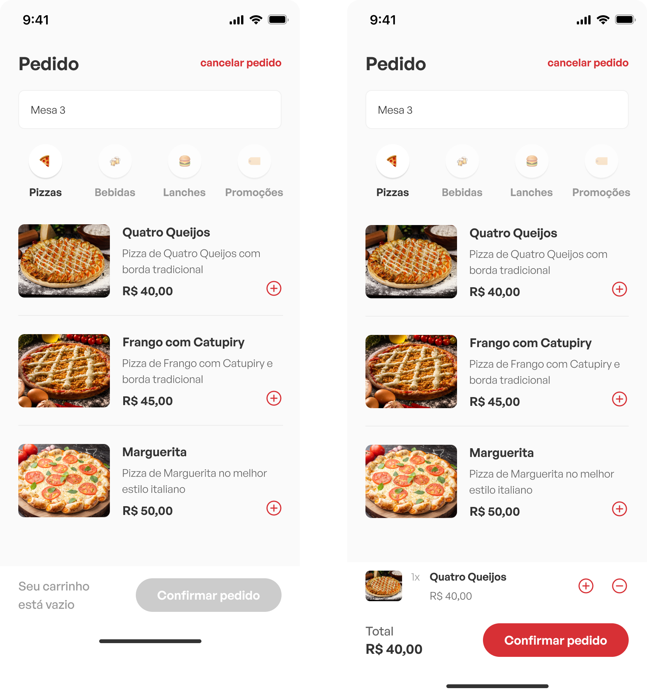

<h1 align="center">
  
</h1>

<p align="center">
 
</p>

<br>

<p align="center">
  
</p>

## 💻 Projeto

O SmartOrder é uma aplicação inovadora projetada para agilizar o processo de atendimento em restaurantes e bares. Com uma interface intuitiva e fácil de usar, SmartOrder permite que os garçons anotem os pedidos dos clientes de forma rápida e eficiente, eliminando a necessidade de anotações em papel e minimizando erros de comunicação.

<h2>🧐 Features</h2>

Aqui estão as principais features do projeto:

* **Interface Intuitiva**: Uma interface de usuário amigável e intuitiva que permite aos garçons navegar facilmente pelas opções de menu e realizar pedidos de forma rápida e eficiente.
* **Catálogo de Produtos**: Um catálogo completo de produtos oferecidos pelo restaurante ou bar, organizado de maneira clara e acessível, com descrições detalhadas e imagens para facilitar a seleção dos clientes.
* **Funcionalidade de Busca**: Um recurso de busca que permite aos garçons encontrar rapidamente itens específicos no menu, facilitando a localização de produtos e agilizando o processo de atendimento.

<h2>🛠️ Installation Steps:</h2>

### Configurando o ambiente

Para iniciar a aplicação localmente é necessário ter [Node](https://nodejs.org) e [yarn](https://yarnpkg.com) previamente instalados.

Também é necessário estar rodando a API do projeto: [SmartOrder API](https://github.com/lucianogmoraesjr/smartorder-api)

### Instalando as dependências

Para a instalar as dependências do projeto, rode o comando:

```bash
$ yarn install
```

### Iniciando a aplicação

Para iniciar a aplicação, rode o comando:

```bash
$ yarn start
```

Baixe o APP [Expo GO](https://expo.dev/go) no seu smartphone e leia o QRCode gerado no terminal, ou rode em um emulador de sua preferência

## 🚀 Built with

Tecnologias utilizadas no projeto:

* [![React Native][rn]][rn-url]
* [![Expo][expo]][expo-url]
* [![TypeScript][typescript]][typescript-url]

<!-- MARKDOWN LINKS & IMAGES -->
[rn]: https://img.shields.io/badge/React%20Native%20-%20%2320232A?style=for-the-badge&logo=React&labelColor=20232a
[rn-url]: https://reactnative.dev/
[expo]: https://img.shields.io/badge/Expo%20-%20%2320232A?style=for-the-badge&logo=Expo&labelColor=20232a
[expo-url]: https://expo.dev
[TypeScript]: https://img.shields.io/badge/TypeScript-20232A?style=for-the-badge&logo=TypeScript&logoColor=%233178C6&labelColor=20232A
[typescript-url]: https://www.typescriptlang.org/
